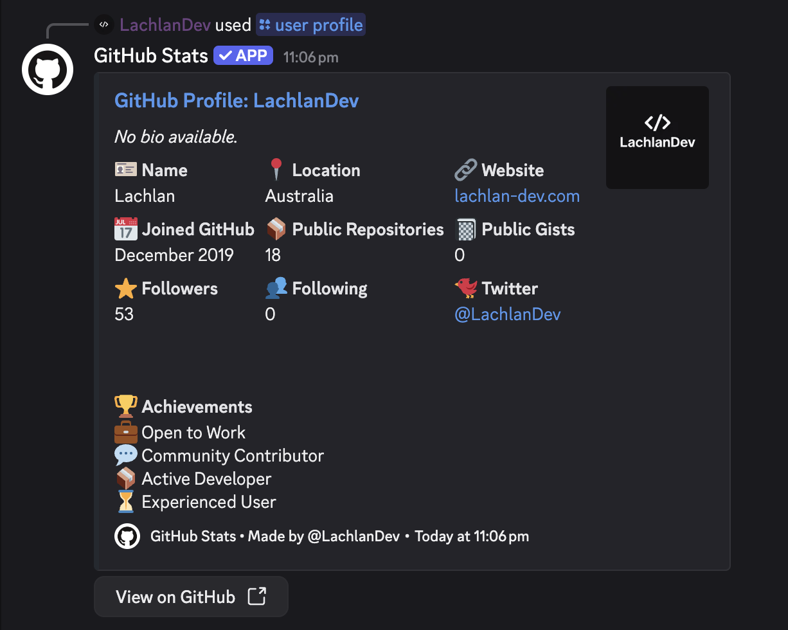
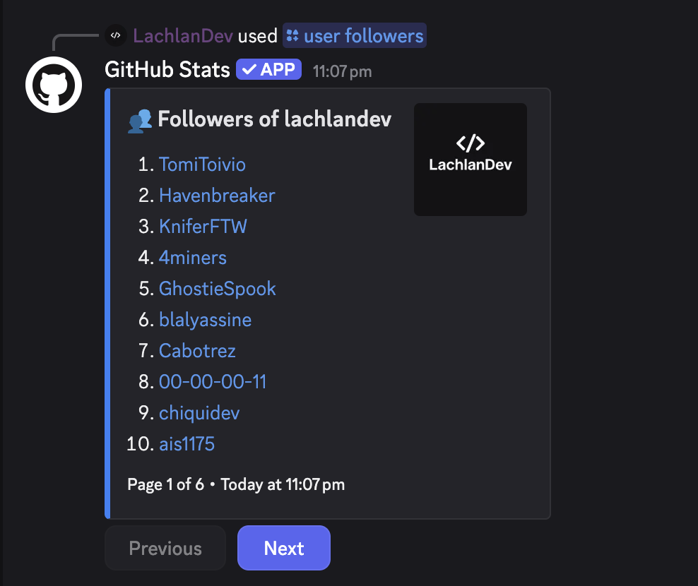

# 📊 GitHub Stats — Discord Bot

A modern and interactive Discord bot for exploring GitHub profiles, repositories, languages, and more — directly from Discord. Built with [Discord.js](https://discord.js.org), powered by the GitHub API, and tailored for developers and communities.

<p align="center">
  <a href="https://discord.com/oauth2/authorize?client_id=1368511664676274186&permissions=277025508352&scope=bot%20applications.commands">
    👉 Invite GitHub Stats Bot to your server
  </a>
</p>

---

<p align="center">
  
</p>

---

## ✨ Features

- 🧑‍💻 View GitHub user profiles with achievements and stats  
- 📦 Get detailed information on any public repository  
- 📚 Browse through all public repos with buttons and menus  
- 📈 See total stars, forks, watchers, and commits  
- 🧠 Analyze all languages used with pie chart visualization  
- 📰 View recent public GitHub activity  

---

## 💻 Commands
## 💻 Commands & Previews

<details>
<summary>🧑‍💻 <code>/user profile [username]</code></summary>

_View a GitHub user profile with stats and achievements._



</details>

<details>
<summary>🧑‍💻 <code>/user followers [username]</code></summary>

_List followers of a GitHub user._



</details>

<details>
<summary>🧑‍💻 <code>/user following [username]</code></summary>

_List who a GitHub user is following._


</details>

<details>
<summary>🧑‍💻 <code>/user statistics [username]</code></summary>

_Summary stats about a GitHub user._


</details>

<details>
<summary>🧑‍💻 <code>/user repos [username]</code></summary>

_List public repositories for a GitHub user._


</details>

<details>
<summary>🧑‍💻 <code>/user languages [username]</code></summary>

_Aggregated language usage across all public repositories._


</details>

<details>
<summary>🧑‍💻 <code>/user activity [username]</code></summary>

_Show recent public GitHub activity._


</details>

<details>
<summary>🧑‍💻 <code>/user stars [username]</code></summary>

_List repositories starred by a GitHub user._


</details>

<details>
<summary>🧑‍💻 <code>/user gists [username]</code></summary>

_List public gists for a GitHub user._


</details>

<details>
<summary>🧑‍💻 <code>/user organizations [username]</code></summary>

_List organizations a GitHub user belongs to._


</details>

---

<details>
<summary>📦 <code>/repo [username] [repo]</code></summary>

_Get detailed information on a GitHub repository._


</details>

---

<details>
<summary>🔍 <code>/search repositories [query]</code></summary>

_Search GitHub repositories._


</details>

## 🚀 Getting Started

```bash
git clone https://github.com/your-username/github-stats-bot.git
cd github-stats-bot
npm install

```
Rename the ``.env.example`` to ``.env.example`` and fill in the following fields.

```
TOKEN=your_discord_bot_token
CLIENT_ID=your_discord_client_id
GUILD_ID=your_guild_id_if_dev_only
GITHUB_TOKEN=your_github_token
ENVIRONMENT=dev
```

Run the bot:
```bash
node src/index.js
```

## 🧪 Tech Stack
- Node.js + Discord.js v14

- GitHub REST API (with personal access token)

- Chart.js via chartjs-node-canvas (for language pie charts)

## 🛠️ Contributing
PRs are welcome! Please fork the repo and submit your improvements or suggestions.

## 📄 License
MIT © @LachlanDev